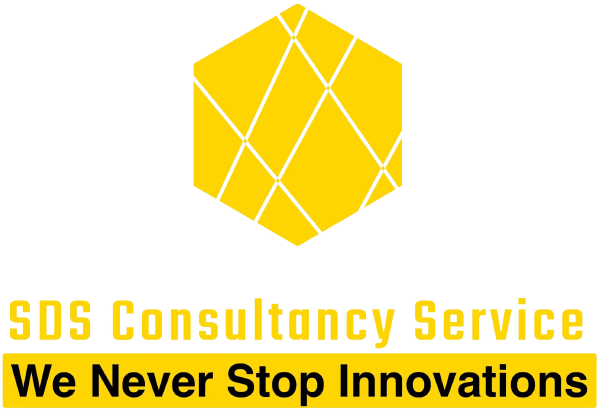
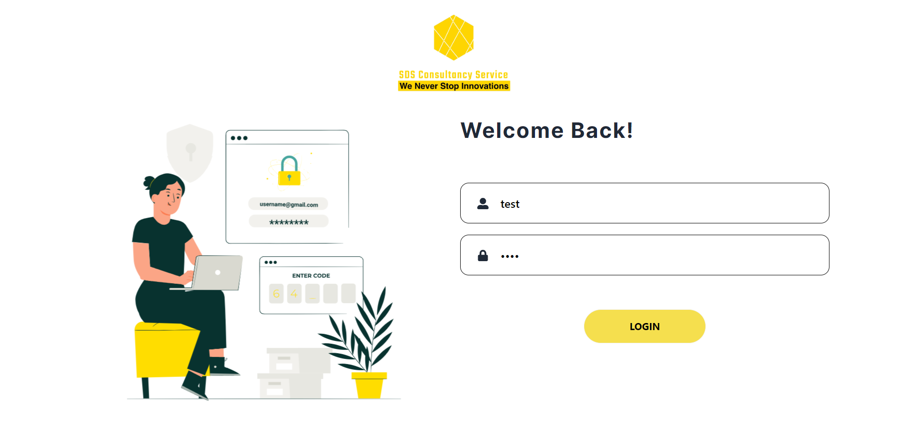
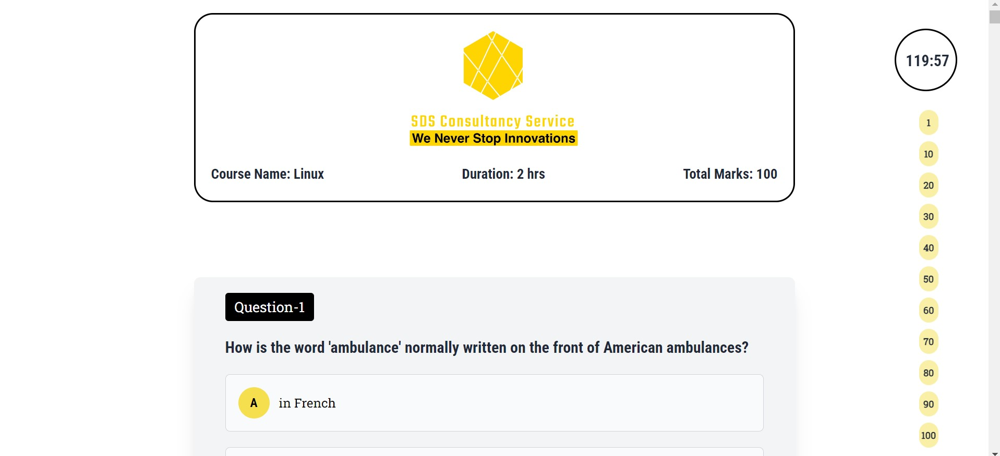
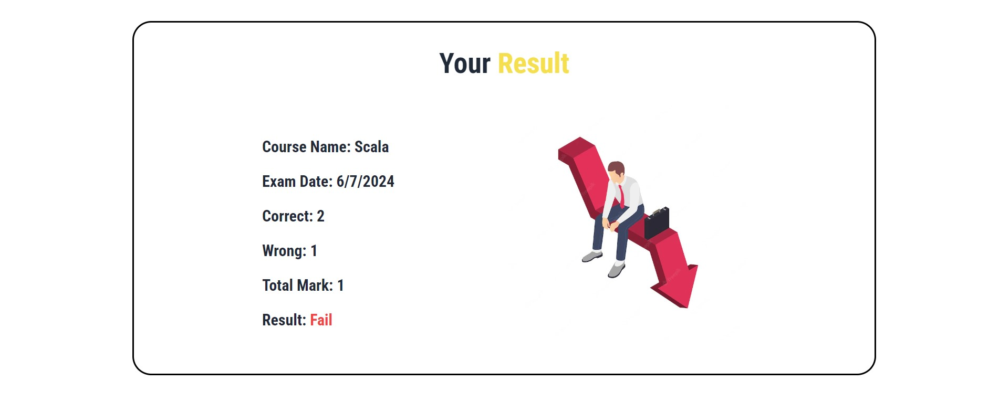
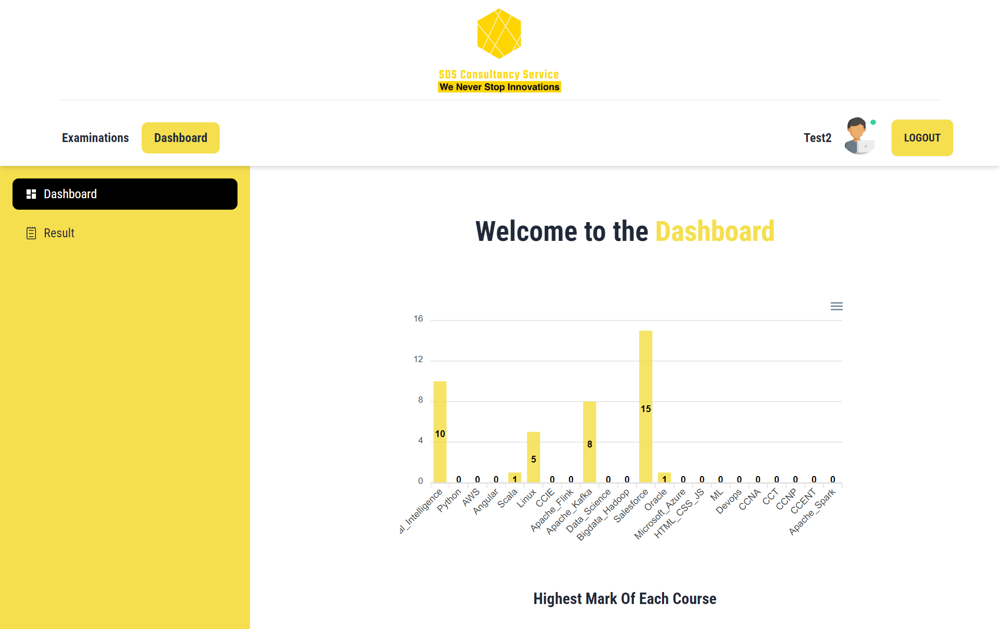
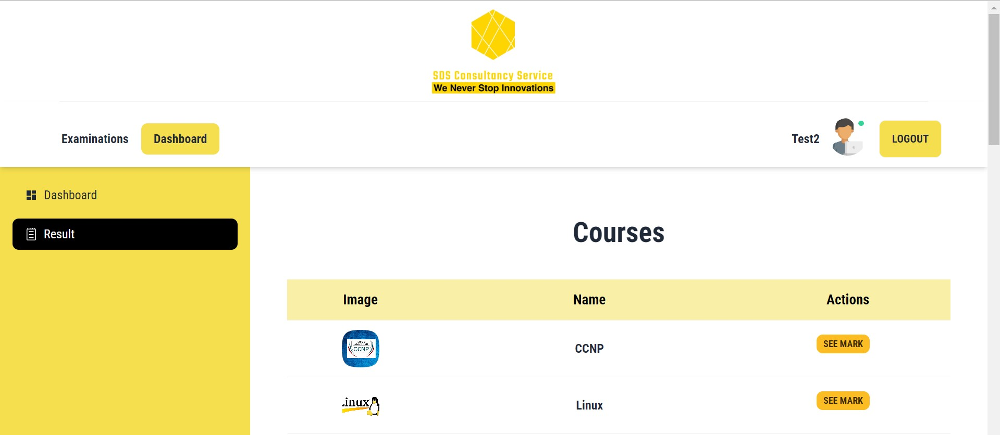
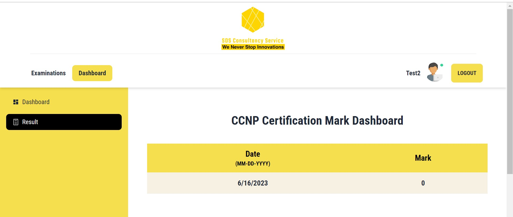

# SDS Consultancy Service Exam Application

SDS Consultancy Service Exam app is a website of giving exams of registered students.

### Live website link: [https://superb-pika-bd1acd.netlify.app/)

## Features

- 22 Courses are available
- User can give exams
- Students can Show their result in the chart
- Can show the given exams result from the dashboard

## Screenshots

## Tech Stack

**Client:** TailwindCSS, ES6, JavaScript, DaisyUi, React, React-FontAwesome, Lottie, React-hook-form, React-router, React-hot-toast,

**Server:** Node, Express, MongoDB, ImageBB
