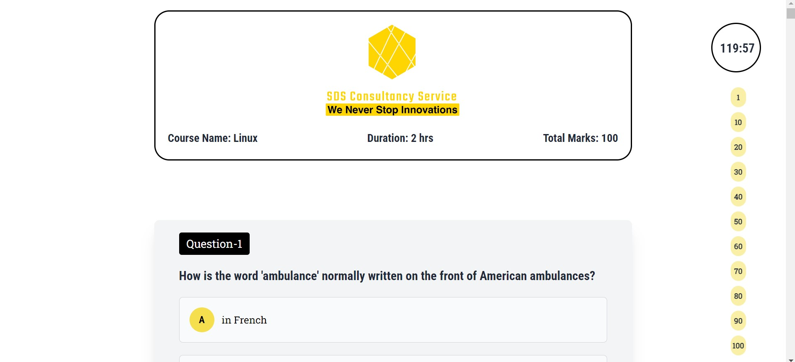

# SDS Consultancy Service Exam Application

SDS Consultancy Service Exam app is a website of giving exams of registered students.

### Live website link: [https://superb-pika-bd1acd.netlify.app/)

## Features

- 22 Courses are available
- User can give exams
- Students can Show their result in the chart
- Can show the given exams result from the dashboard

## Screenshots

## Tech Stack

**Client:** TailwindCSS, ES6, JavaScript, DaisyUi, React, TanStackQuery, React-FontAwesome, Lottie, React-paginate, EmailJS, React-hook-form, Stripe, React-router, React-hot-toast, Swiper.js, JWT

**Server:** Node, Express, Firebase, MongoDB, ImageBB

## Admin

Email: abdurrahman@gmail.com

password: 123456
